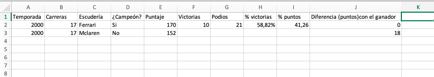

# Base de Datos
Por Antonia Castillo

Base de datos: https://github.com/jolpica/jolpica-f1

## Método de recolección
La base de datos se construirá con API Jolpica F1. Lo que haremos es extraer automáticamente la información desde los 2000 en el formato JSON. A partir de esto, generaremos un tabla y cada fila representará una escudería en cierto período. Además, se calcularán variables adicionales como el puntaje de cada uno y el porcentaje de victorias. 

También, realizaremos de manera manual una base de datos de hitos históricos. En esta, se incluirán los cambios en el área técnica, deportiva y financiera que sean relevantes (mediante documentos de la FIA y Formula1.com). A partir de esto, se podrá contextualizar los períodos en los que hay mayor o menor concentración de victorias hacia ciertos equipos. 

### Autor y descripción
Jolpica F1 es una API de código abierto, que se mantiene por colaboradores voluntarios. Está publicada en Github, y la encontré investigando por una base de datos con toda la información de la historia de la Fórmula 1. La información puede consultarse directamente mediante su API y sus vínculos con otras páginas, aunque también se pueden descargar bases de datos desde el propio proyecto.

La base contiene toda la información histórica de la Fórmula 1. Incluye temporadas, carreras, pilotos, escuderías, resultados y clasificaciones. Para nuestra investigación utilizaremos principalmente las victorias de los constructores por temporada, su posición final, puntos obtenidos y número de victorias. También, consideraremos, la lejanía en puntaje que existe entre los cinco mejores con los cinco peores. 

### Metodología
Nos concentramos en el periodo desde el año 2000, es decir los últimos 25 años (temporada 2026 se dejará fuera, ya que aún no termina). A partir de esto ordenaremos los datos con porcentaje de victorias, puntos acumulados por los equipos principales y comparación con los equipos más débiles.

### Valor
Esta base de datos es valiosa ya que permite acceder a los resultados completos. Así podremos analizar cómo se distribuye todo dentro del campeonato. A partir de esta información, podremos construir indicadores propios de concentración. Esto servirá para comparar años y tener todo lo necesario en un mismo lugar. Por último, el formato de Jolpica es fácil de descifrar y comprender.  

Con estos datos construiremos nuestra propia base con nuestro enfoque. Cada temporada incluirá los principales equipos, sus puntos, victorias y posiciones. Calcularemos indicadores propios de concentración y definiremos los factores que hacen la diferencia. 

### Excel y variables

