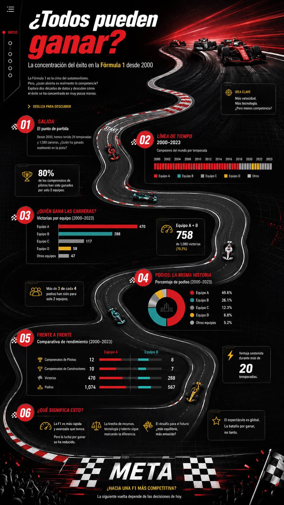

# ¿Todos pueden ganar? La concentración del éxito en la Fórmula 1

## Síntesis del proyecto
La Fórmula 1 es la competición más prestigiosa de automovilismo internacional. Esta categoría reúne cada temporada a distintos equipos con sus respectivos pilotos, que compiten bajo el mismo campeonato. Desde el año 2000, la edición ha atravesado distintos cambios técnicos, reglamentarios, deportivos y financieros que han modificado las condiciones de competencia y la forma en que los equipos desarrollan sus monoplazas y estrategias.  

Por esta misma razón, últimamente ha habido muchos cambios en la estructura por la implementación de novedades. La cantidad de carreras, los sistemas de puntuación, los reglamentos técnicos y los presupuestos financieros han transformado la F1, permitiéndonos observar distintas etapas dentro de la historia reciente, lo cual nos hace plantearnos preguntas sobre cómo se ha distribuido el éxito entre quienes participan y qué lo ha definido. 

El proyecto busca investigar qué tan competitiva ha sido la Fórmula 1 desde el año 2000, observando cómo se distribuyen las victorias y campeonatos entre pilotos y escuderías. A partir de datos históricos se buscará identificar patrones y comparar distintos períodos, con el objetivo de determinar si el éxito se reparte entre varios participantes o si tiende a concentrarse en un grupo reducido.

**Pregunta de investigación:** ¿Cómo se configura la concentración competitiva en la Fórmula 1 desde el año 2000 a la actualidad? 

**Hipótesis:** La concentración competitiva en la Fórmula 1 desde el año 2000 se ha estructurado en torno al dominio recurrente de un grupo reducido de escuderías, favorecido por diferencias deportivas, técnicas y económicas que dificultan una distribución equilibrada de la competencia.

## Antecedentes del tema
Se ha publicado distinta información respecto al tema. En la página oficial de la Fórmula 1, se encuentra el apartado “¿Quiénes son los pilotos de F1 más exitosos de todos los tiempos?”, en donde se menciona que en la lista histórica, Michael Schumacher comparte el récord de siete títulos con Lewis Hamilton. También, se agregan los siguientes pilotos en la lista.

Además, se mencionan los equipos más exitosos, destacando a Ferrari como el con mayores campeonatos ganados, seguido de McLaren, Mercedes, Red Bull y Williams. En este documento se presentan los datos de manera objetiva a través de hechos. Sin embargo, se incluye información previa a los 2000, lo que se aleja de nuestra selección de tiempo. 

Además, Motorsport publicó el artículo “Todos los títulos, campeones y mundiales de la F1 en la historia, año a año” el 2025, en el que se muestra un gráfico indicando el piloto, equipos y puntajes de los ganadores desde 1950, cuando se realizó por primera vez. De esta manera, el enfoque presenta la misma dificultad del documento anterior, ya que nosotros lo analizaremos desde el 2000. 

## Datos
Para probar la tesis de que existe una concentración competitiva en la F1 desde los 2000, llevando a que un grupo reducido de escuderías tienda a ganar la victoria, necesitamos analizar la base de datos año por año para obtener las victorias repetidas. Esto será sencillo de obtener, ya que esa información existe, es pública y confiable, al ser publicada por la página oficial de F1 y un medio de noticias. 

Ahora bien, la segunda parte de la hipótesis indica que esta concentración se debe a diferencias deportivas, técnicas y económicas, lo que dificulta una distribución equilibrada de la competencia. Para probar esto, se deberá buscar más información y conseguir esos datos que aún no los tenemos. Para obtenerlos buscaremos los montos requeridos para acceder a la competencia y los implementos necesarios. Esto requerirá una mayor investigación pero deberían ser públicos. 

## Preguntas a responder
Buscamos responder una serie de preguntas, las cuales se concentrarían en entender y analizar la incidencia de distintas variables en el éxito de la Fórmula 1, en correlación con el capital, cambios del reglamento y ventanas de oportunidades a la competencia. Algunas de estas interrogantes serían:

* ¿Qué tan grande es la distancia entre los líderes y el resto de la tabla?
* ¿Los cambios de reglas qué tan efectivos han resultado para “nivelar la competencia”?
* ¿Cómo cambia el podio en la acumulación de derrotas y victorias con los nuevos reglamentos? Por ejemplo, el límite presupuestario.
* ¿Qué tan influyente es el capital monetario para asegurar el triunfo en las carreras?
* ¿Cuál es el registro de oportunidad y éxito en equipos pequeños de la competencia?

## Historia visual
La historia recorre los últimos años de la Fórmula 1 y se plantea una pregunta central: realmente “¿Todos pueden ganar?”. El proyecto busca mostrar cómo se ha distribuido el éxito de esta disciplina desde el año 2000, considerando los recientes 25 campeonatos. El foco estará en quién fue campeón, qué tan concentradas estuvieron las victorias y qué factores afectaron los resultados.

Lo nuevo del proyecto es observar la concentración competitiva, analizarla y sacar conclusiones sobre ella. Definir aspectos que hacen la diferencia, que hacen el deporte más emocionante y por lo tanto atractivo y rentable. Por esto, compararemos las temporadas y buscaremos entender cómo funciona desde adentro. 

Nos gustaría desarrollar una webstory interactiva con scroll, donde el usuario recorra una pista, con diferentes paradas que contengan información, y que el camino les sirva para ir descifrando, en conjunto con el grupo, la respuesta a la pregunta central. Será un circuito que recorrerá el tiempo y los cambios en la Fórmula 1. Al llegar a la meta, el receptor habrá vivido una experiencia, que es la carrera de vida de la disciplina automovilística. 

La historia incluirá una línea de tiempo que pasará por las temporadas, gráficos interactivos, comparaciones de los equipos, tarjetas con hitos y cambios relevantes, entre otros. Estos elementos permitirán que el usuario vea de forma rápida y entretenida cómo se reparte el éxito y cuál es la razón de ese triunfo.

**Referencias visuales:**
* [K-pop Generations - The Pudding](https://pudding.cool/2026/05/kpop-generations/)
* [NBA Uniforms - The Pudding](https://pudding.cool/2024/10/nba-uniforms/)
* [Superteams - The Pudding](https://pudding.cool/2017/10/superteams/)

**Referencias propias:**
Le pedimos a ChatGPT que generara imágenes de cómo imaginamos la página. En el prompt indicamos la idea general, colores principales y elementos por agregar. El producto final no se verá exactamente así, va a variar, pero la idea simplificada está en la imagen.

## Resultados
Dentro de los resultados esperados de este proyecto, se parte desde una base sólida; solamente como el mínimo, construiremos una radiografía tanto visual como descriptiva de la concentración de victorias y éxito de la Fórmula 1 desde los 2000 hasta lo más reciente. Con los datos duros que ya recabamos podremos contar de forma empírica: acaparamiento de victorias, podios y campeonatos liderados por escuderías menores, y producir gráficas para demostrar la desigualdad y brechas existentes en competencias específicas.

A partir de esta base, también buscamos extrapolar al límite el potencial de nuestra historia, apuntando a la novedad de información de la misma. Poder revelar y cruzar un análisis sobre el impacto de las modificaciones reglamentarias y el cambio que introdujeron los motores híbridos, logrando anexar aquellos datos con hitos importantes ocurridos en la historia del deporte. Buscar el detrás de las causas económicas y hegemónicas que se han dictado en distintos periodos de años de la F1. 

Evaluando si las intervenciones de la FIA han funcionado realmente a través del tiempo, esto en su búsqueda de democratizar el deporte a una libre competencia de acceso a aquellos equipos de menor poder económico.
